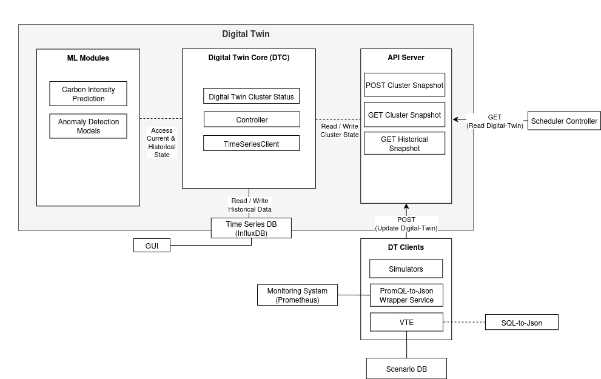

# DECICE Digital Twin

## Overview
The DECICE Digital Twin(DT) is a FastAPI-based service for representing, simulating, and monitoring compute continuum systems (Cloud, HPC, Edge, IoT). It provides a REST API for managing the digital twin model and interacting with time series data via InfluxDB.

## Architecture



- **Digital Twin Core(DTC)** - The Digital Twin Core module defines the Digital Twin data [model](#digital-twin-model) and contains the logic to embed this model into a [time series storage](#influxdb-time-series-store) with the appropriate schema

- [**API Server**](#api-endpoints) - The API module offers a FastAPI-based REST interface to access and update the Digital Twin model, manage its components, and read/write time series data. It connects clients to the core logic.

- [**Simulator**](#emulatorsimulator) - The simulator reads a YAML file in fixed format, emulates dynamic metrics using statistical sampling, converts data to the Digital Twin model, and sends periodic updates to the Digital Twin API.

- **ML Modules** - ML Modules can be directly integrated inside DT also can use external [endpoints](historical_data.md#digital-twin---influxdb-wrapper-endpoints) to update Time-Series storage of DT.


#### External Services
- [kube-prometheus-stack](https://gitlab-ce.gwdg.de/decice/monitoring-stack/-/tree/minio/prometheus-stack) - Source of Node Hardware Metrics and Kubernetes object state metrics. `kube-prometheus-stack` helm chart manages Prometheus and ServiceMonitors, making it easy to auto-discover metrics targets.
- [WATMON Service and Network exporters](https://gitlab-ce.gwdg.de/decice/decice-wp2/-/tree/digital-twin-dev/watmon) - Source of Active Network Measurement metrics and topology information
- [PromQL-to-JSON Wrapper](https://gitlab-ce.gwdg.de/decice/decice-wp3/-/tree/promql-power-metrics-config/decice_framework/prom-json-wrapper) - DECICE Service that updates Digital-Twin via Prometheus Metrics converted into Digital-Twin JSON Model
- [InfluxDB](historical_data.md#digitaltwin--influxdb-interface) - Stores time-series metrics and historical snapshots from the Digital Twin, enabling temporal queries and analysis of compute resource, Workloads and Network Trends.

---

## API Endpoints

### Core Digital Twin
- `POST /api/model_core/` — Update the digital twin model (JSON body)
- `GET /api/model_core/` — Get the latest digital twin state.

### Subcomponents & Timeseries
- `GET /api/settings/` — Get current service settings
- `GET /api/nodes/` — List all nodes from latest digital twin state
- `GET /api/links/` — List all links from latest digital twin state
- `GET /api/jobs/` — List all jobs from latest digital twin state
- [`POST /api/timeseries/write_record/`](historical_data.md#-post-timeserieswrite_record) — Write custom timeseries points to InfluxDB
  - Body: list of `{timetamp, tags, fields, measurement}` and `bucket` query param
- [`POST /api/timeseries/read_record/`](historical_data.md#-post-timeseriesread_record) — Read timeseries points from InfluxDB
  - Body: `{time_range, measurement, bucket, tags}`
- [`GET /api/past_snapshots?start=-60m&stop=-10m`](historical_data.md#1-get-historical-snapshots-in-a-time-range) — Get historical digital twin snapshots in range from InfluxDB
- [`GET /api/past_snapshots/<ISO8601 Timestamp>`](historical_data.md#2-get-a-single-snapshot-at-a-specific-time) — Get a specific past digital twin snapshots in time.

## Digital Twin Model 

- [JSON Schema](configs/DT_json_schema.json)
- [Pydantic Model](src/digital_twin/core/data_model.py)
- [Example](./last_emulate_result.json)

The Digital Twin model represents the state of a compute continuum system at a point in time. It is structured as follows:

### Vertexpools
A **Vertexpool** is a group of nodes and/or devices in the same network segment (e.g., a cluster, edge site, or device group).
- `id`: Unique identifier for the vertexpool.
- `vertexpool_labels`: Arbitrary key-value labels (e.g., region, type).
- `nodes`: List of compute nodes in this vertexpool.
- `devices`: List of devices (e.g., sensors, cameras) in this vertexpool.
- `lastUpdated`: Epoch timestamp of last update.

### Nodes
A **Node** represents a cluster resource (server, VM, edge device) that is considered in scheduling decisions and is capable of running workloads (e.g., containers, pods). These are the nodes where workloads can be placed and executed by the orchestrator.
- `id`, `name`, `system`: Identifiers and system type.
- `node_info`: Additional info (arch, os, rack, provider, etc.).
- `metrics`:
  - `util`: CPU utilization (%)
  - `mem_util`: Memory utilization (%)
  - `network_bandwidth_mbps`: Network bandwidth (Mbps)
  - `free_disk_gb`, `total_disk_gb`: Disk space (GB)
  - `cpu_cores`, `mem_total`: Hardware specs
  - `power_watts`: Power consumption (Watts)

### Devices
A **Device** is a non-cluster node (e.g., sensor, camera, or external endpoint) that cannot run containers but is included for network measurement and monitoring. Devices can be grouped into Vertexpools and are useful for tracking network metrics to endpoints outside the main cluster.
- `id`, `name`: Identifiers
- `labels`: Arbitrary key-value labels (e.g., type)
- `device_info`: Additional info (model, location, etc.)

### Links
A **Link** represents a network connection between two vertexpools.
- `vertexpool_a_id`: ID of the source vertexpool
- `vertexpool_b_id`: ID of the destination vertexpool
- `network_delay_ms`: Network delay in milliseconds
- `lastUpdated`: Epoch timestamp of last update

### Jobs (Work In Progress)
A **Job** represents a workload or application running on the system.
- `id`: Job identifier
- `pods`: List of pods (containers) associated with the job
- `profile`: Scheduling profile (optional)
- `lastUpdated`: Epoch timestamp

#### Example Digital Twin Model
```json
{
  "lastUpdated": 1751875998.491004,
  "vertexpools": [
    {
      "id": "vp-compute-1",
      "vertexpool_labels": {
        "region": "edge-east"
      },
      "nodes": [
        {
          "id": "node-a1",
          "name": "node-a1",
          "system": null,
          "node_info": {
            "arch": "amd64",
            "os": "linux",
            "rack": "r1"
          },
          "metrics": {
            "util": 46.16,
            "mem_util": 31.86,
            "network_bandwidth_mbps": 500.0,
            "free_disk_gb": 200.7,
            "total_disk_gb": 512.0,
            "cpu_cores": 8.0,
            "mem_total": 32.0,
            "power_watts": 75.4
          }
        }
      ],
      "devices": [],
      "lastUpdated": null
    },
    {
      "id": "vp-compute-2",
      "vertexpool_labels": {
        "region": "cloud"
      },
      "nodes": [
        {
          "id": "node-b1",
          "name": "node-b1",
          "system": null,
          "node_info": {
            "provider": "aws",
            "instance_type": "c6i.8xlarge",
            "region": "us-west-1"
          },
          "metrics": {
            "util": 27.54,
            "mem_util": 19.16,
            "network_bandwidth_mbps": 1000.0,
            "free_disk_gb": 4000.5,
            "total_disk_gb": 5000.0,
            "cpu_cores": 32.0,
            "mem_total": 256.0,
            "power_watts": 284.36
          }
        }
      ],
      "devices": [],
      "lastUpdated": null
    },
    {
      "id": "vp-device-1",
      "vertexpool_labels": {
        "region": "device-zone"
      },
      "nodes": [],
      "devices": [
        {
          "id": "device-c1",
          "name": "sensor-xyz",
          "labels": {
            "type": "camera"
          },
          "device_info": {
            "model": "IMX500",
            "location": "rooftop",
            "stream_type": "rtsp"
          }
        }
      ],
      "lastUpdated": null
    }
  ],
  "links": [
    {
      "vertexpool_a_id": "vp-compute-1",
      "vertexpool_b_id": "vp-compute-2",
      "network_delay_ms": 10.356664980723766,
      "lastUpdated": null
    },
    {
      "vertexpool_a_id": "vp-compute-2",
      "vertexpool_b_id": "vp-compute-1",
      "network_delay_ms": 15.187814521129383,
      "lastUpdated": null
    },
    {
      "vertexpool_a_id": "vp-compute-1",
      "vertexpool_b_id": "vp-device-1",
      "network_delay_ms": 2.8964724459999447,
      "lastUpdated": null
    },
    {
      "vertexpool_a_id": "vp-compute-2",
      "vertexpool_b_id": "vp-device-1",
      "network_delay_ms": 14.93994546819909,
      "lastUpdated": null
    }
  ],
  "jobs": []
}
```

---

## InfluxDB (Time-Series Store)  

InfluxDB stores historical cluster snapshots and custom Digital Twin data by converting JSON models into a flat measurement schema using tags and fields. This allows partial queries on specific entities via Flux or REST API wrappers. It supports long-term trend analysis, anomaly detection, and serves as input for AI-driven scheduling models.  
For furher reading see [DigitalTwin / InfluxDB Interface markdown](historical_data.md)

## Local Development & Usage

### Prerequisites
- Python >= 3.10
- GNU Make >= 4.3
- Docker (for local InfluxDB)

### 1. Install & Run
```bash
make venv         # Set up Python virtual environment
make install      # Install dependencies
cp .env.example .env
vim .env
make run_dt       # Start the Digital Twin API (default: http://127.0.0.1:8010)

# alternatively (requires python>3.12)
python -m venv venv 
source venv/bin/activate
pip install poetry
poetry install
python src/digital_twin/main.py
```

### 2. Local InfluxDB (Optional)
To enable time series features locally:
```bash
make run_influxdb # Starts InfluxDB in Docker and sets up .env
# .env will be overwritten copy over changes from .env.example
vim .env
# run the digital twin again after .env gets updated by above command
make run_dt

# alternatively (requires python>3.12)
python -m venv venv 
source venv/bin/activate
pip install poetry
poetry install
python src/digital_twin/main.py
```

### Emulator/Simulator 
The emulator (soon to be renamed to simulator) simulates simple cluster behaviour from a YAML file and periodically updates the API.    
[`emulate.yaml`](emulate.yaml) can be updated while the emulator is running to simulate cluster behaviour.

```bash
make emulate
# or directly:
./scripts/emulate.sh <yaml_path> [--dt_url URL] [--freq SECONDS]
```
- `<yaml_path>`: Path to emulation YAML (default: emulate.yaml)
- `--dt_url`: Digital Twin API URL (default: http://127.0.0.1:8010)
- `--freq`: Update frequency in seconds (default: 30)

#### YAML Fields for Resource Usage Simulation

- `util`: CPU utilization (%) sampled from a normal distribution with specified mean and stdev.
  - `mem_util` and `power_watts`: Derived from util, modeling memory usage and power consumption proportional to CPU load.

- `power_factor` (optional): Multiplier applied to power_watts to adjust simulated power consumption per node.

- `links`: Simulate network latency between vertexpools, with network_delay_ms sampled from a normal distribution defined by mean and stdev.
---

## Kubernetes Deployment (Helm)
### Prerequisites
- Helm (for Kubernetes deployment)
- kube-prometheus-stack deployed on cluster
- DECICE PromQL-JSON-Wrapper service (to update Digital-Twin) 
- WATMON (optional) (for topology info and network measurements)

The Helm chart (`deployment/dt-chart/`) deploys both the Digital Twin and an InfluxDB instance.

### Deploy with Helm
```bash
cd deployment/dt-chart
helm install dt . -n decice --create-namespace
```
- The Digital Twin will be accessible via the configured service (default NodePort: 30081).
- InfluxDB is deployed as a subchart and pre-configured for the Digital Twin. (default NodePort: 32086, default username:password is `admin:admindecice`)
- All connection details are set via the chart's `values.yaml`.

