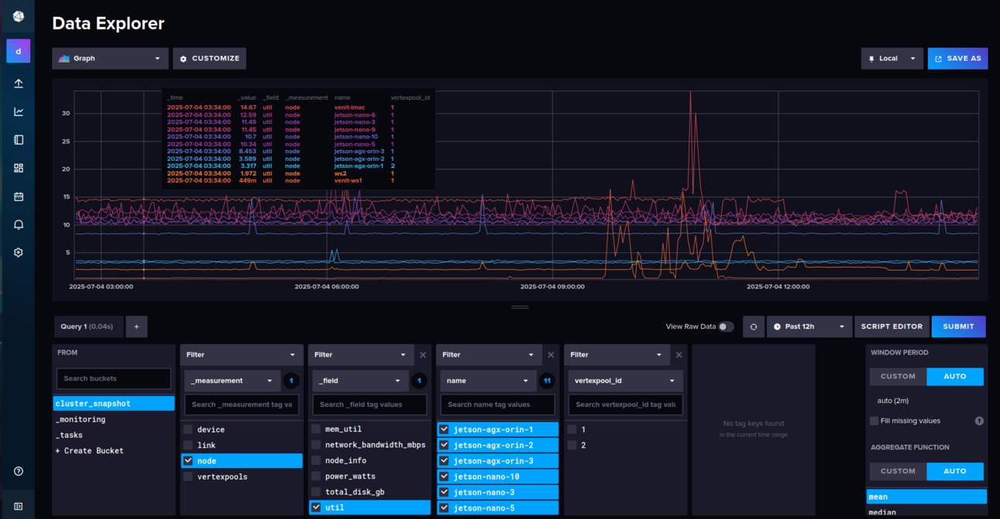
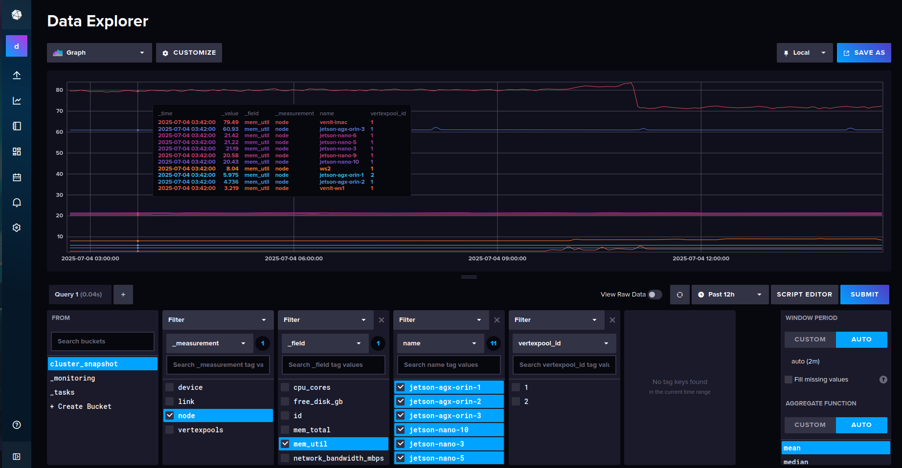
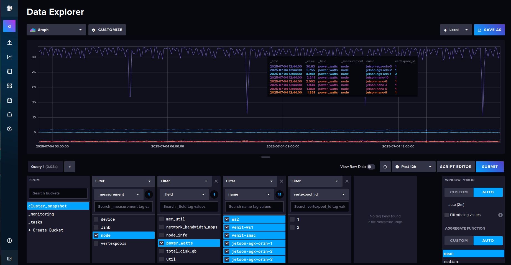
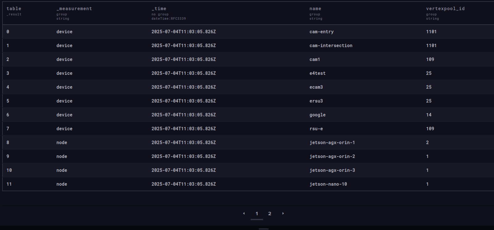
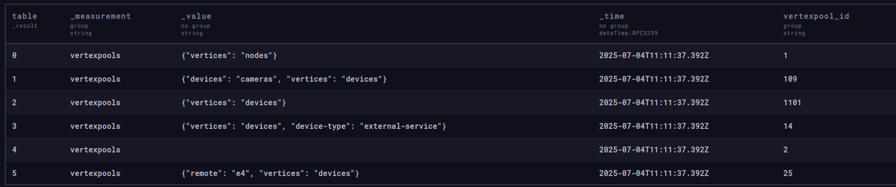
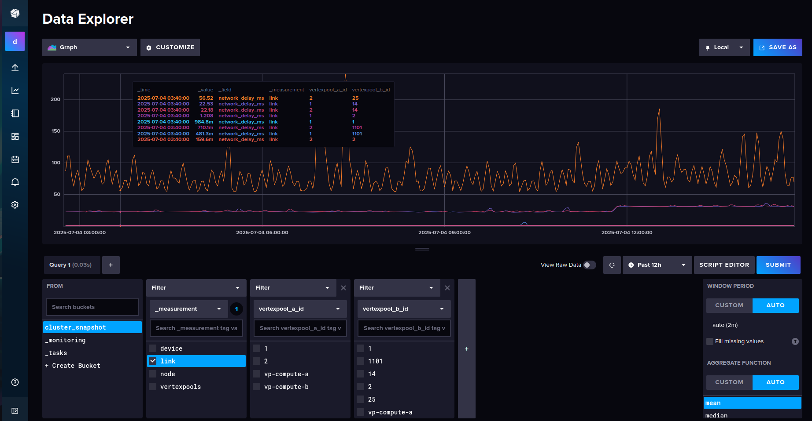

# DigitalTwin / InfluxDB Interface
This document describes the integration between the DigitalTwin system and InfluxDB for storing and querying historical snapshots of the cloud-edge continuum state. It covers the Digital-Twin REST API endpoints that provide access to cluster snapshot data and custom time-series metrics, as well as the InfluxDB cluster_snapshot bucket schema. Additionally, it includes examples of using the InfluxDB GUI and Flux queries for direct access to saved time-series data, enabling historical analysis and metric exploration beyond the Digital-Twin API.
## Digital-Twin Historical Snapshots API

The Digital-Twin system provides access to **historical snapshots** of the cloud-edge continuum state via the `/api/past_snapshots/` API route. This allows querying the cluster snapshots specific time or intervals in time
### API Endpoints

#### 1. Get Historical Snapshots in a Time Range

```
GET /api/past_snapshots/?start=<start_time>&stop=<stop_time>
```

- **Query Parameters:**
  - `start`: Start time in ISO8601 format or relative time (e.g., `-30m` for 30 minutes ago).
  - `stop`: Stop time in ISO8601 format or relative time. (Optinal, if omited defaults to now)

- **Description:**
  Returns all historical snapshots between the specified `start` and `stop` times.

- **Example:**

```bash
curl -s 'http://127.0.0.1:8010/api/past_snapshots/?start=-30m&stop=-25m' -H 'accept: application/json' | jq '
  to_entries | 
  map({
    key: .key, 
    vertexpools_count: (.value.vertexpools | length), 
    links_count: (.value.links | length), 
    jobs_count: (.value.jobs | length),
    lastUpdated: .value.lastUpdated
  })
'
```

- **Sample response:**

```json
[
  {
    "key": "2025-07-04T13:15:55.975953+00:00",
    "vertexpools_count": 3,
    "links_count": 6,
    "jobs_count": 0,
    "lastUpdated": 1751634955.975953
  },
  {
    "key": "2025-07-04T13:15:25.934056+00:00",
    "vertexpools_count": 3,
    "links_count": 6,
    "jobs_count": 0,
    "lastUpdated": 1751634925.934056
  }
]
```

---

#### 2. Get a Single Snapshot at a Specific Time

```
GET /api/past_snapshots/<ISO8601-date>
```

- **Parameter:**
  - `<ISO8601-date>`: Exact timestamp in ISO8601 format specifying the snapshot time.

- **Description:**
  Retrieves the cluster snapshot data at a specific instant.

- **Example:**

```bash
curl -s 'http://127.0.0.1:8010/api/past_snapshots/2025-07-04T13:15:25.934056+00:00' | jq .
```

- **Sample response:**

```json
{
  "lastUpdated": 1751634925.934056,
  "vertexpools": [
    {
      "id": "vp-compute-1",
      "vertexpool_labels": {
        "region": "edge-east"
      },
      "nodes": [
        {
          "id": "node-a1",
          "name": "node-a1",
          "system": null,
          "node_info": {
            "arch": "amd64",
            "os": "linux",
            "rack": "r1"
          },
          "metrics": {
            "util": 68.18,
            "mem_util": 51.08,
            "network_bandwidth_mbps": 500,
            "free_disk_gb": 200.7,
            "total_disk_gb": 512,
            "cpu_cores": 8,
            "mem_total": 32,
            "power_watts": 101.81
          }
        },
        {
          "id": "node-a2",
          "name": "node-a2",
          "system": null,
          "node_info": {
            "arch": "arm64",
            "os": "linux",
            "zone": "z1"
          },
          "metrics": {
            "util": 46.1,
            "mem_util": 36.43,
            "network_bandwidth_mbps": 70,
            "free_disk_gb": 100.1,
            "total_disk_gb": 256,
            "cpu_cores": 4,
            "mem_total": 16,
            "power_watts": 33.83
          }
        }
      ],
      "devices": [],
      "lastUpdated": null
    },
    {
      "id": "vp-compute-2",
      "vertexpool_labels": {
        "region": "cloud"
      },
      "nodes": [
        {
          "id": "node-b1",
          "name": "node-b1",
          "system": null,
          "node_info": {
            "provider": "aws",
            "instance_type": "c6i.8xlarge",
            "region": "us-west-1"
          },
          "metrics": {
            "util": 24.83,
            "mem_util": 17,
            "network_bandwidth_mbps": 1000,
            "free_disk_gb": 4000.5,
            "total_disk_gb": 5000,
            "cpu_cores": 32,
            "mem_total": 256,
            "power_watts": 258.4
          }
        }
      ],
      "devices": [],
      "lastUpdated": null
    },
    {
      "id": "vp-device-1",
      "vertexpool_labels": {
        "region": "device-zone"
      },
      "nodes": [],
      "devices": [
        {
          "id": "device-c1",
          "name": "sensor-xyz",
          "labels": {
            "type": "camera"
          },
          "device_info": {
            "model": "IMX500",
            "location": "rooftop",
            "stream_type": "rtsp"
          }
        }
      ],
      "lastUpdated": null
    }
  ],
  "links": [
    {
      "vertexpool_a_id": "vp-compute-1",
      "vertexpool_b_id": "vp-compute-1",
      "network_delay_ms": 1.84,
      "lastUpdated": null
    },
    {
      "vertexpool_a_id": "vp-compute-1",
      "vertexpool_b_id": "vp-compute-2",
      "network_delay_ms": 13.65,
      "lastUpdated": null
    },
    {
      "vertexpool_a_id": "vp-compute-1",
      "vertexpool_b_id": "vp-device-1",
      "network_delay_ms": 3.70,
      "lastUpdated": null
    },
    {
      "vertexpool_a_id": "vp-compute-2",
      "vertexpool_b_id": "vp-compute-1",
      "network_delay_ms": 11.05,
      "lastUpdated": null
    },
    {
      "vertexpool_a_id": "vp-compute-2",
      "vertexpool_b_id": "vp-compute-2",
      "network_delay_ms": 1.12,
      "lastUpdated": null
    },
    {
      "vertexpool_a_id": "vp-compute-2",
      "vertexpool_b_id": "vp-device-1",
      "network_delay_ms": 26.38,
      "lastUpdated": null
    }
  ],
  "jobs": []
}
```

---

## Digital Twin - InfluxDB Wrapper Endpoints
`POST /timeseries/write_record/` and  `POST /timeseries/read_record/` endpoints provide a thin wrapper over InfluxDB to **write and query time-series data** related to the digital twin system. They are useful for recording and retrieving custom metrics outside of the standard cluster snapshot logic.  
Note that used bucket must exists in InfluxDB.

### 🔸 `POST /timeseries/write_record/`

Write one or more custom time-series points to a specified InfluxDB bucket.

- **Request Body (list of `TimeSeriesPointWrite`)**:
  - `measurement`: (str) InfluxDB measurement name (e.g., "temperature", "status")
  - `timetamp`: (optional) `datetime` or Unix timestamp (defaults to now if `None`)
  - `tags`: (dict, optional) Key-value tags for indexing and filtering
  - `fields`: (dict, optional) Actual data fields (e.g., `{ "value": 42 }`)

- **Query Parameter**:
  - `bucket`: (str) Target InfluxDB bucket to write to

- **Response**:
  - HTTP `201 Created` on success

---

### 🔹 `POST /timeseries/read_record/`

Query time-series records from InfluxDB using flexible tag-based filters.

- **Request Body (`TimeSeriesPointRead`)**:
  - `measurement`: (str) Measurement name to query
  - `bucket`: (str) Bucket name to query from
  - `time_range`: (object) Time range with `start` and optional `end`
  - `tags`: (dict, optional) Tag filters (e.g., `{ "node": "worker-1" }`)

- **Response**:
  - Returns a `list[dict]` of matching points

### 🛠️ Error Handling

Both endpoints wrap InfluxDB `ApiException`s and return structured `HTTPException`s with a JSON body including:
- `error`: Raw InfluxDB error or message
- `message`: Human-readable context

### Example Usage

```bash
# POST /timeseries/write_record/?bucket=my_bucket
curl -X POST "http://localhost:8010/api/timeseries/write_record/?bucket=my_bucket" \
  -H "Content-Type: application/json" \
  -d '[
    {
      "measurement": "prediction",
      "timetamp": "2025-07-04T12:00:00Z",
      "tags": {
        "workload": "my_workload_1",
        "nodename": "ws2"
      },
      "fields": {
        "predicted_load": 0.78,
        "confidence": 0.92
      }
    },
    {
      "measurement": "prediction",
      "timetamp": "2025-07-04T12:01:00Z",
      "tags": {
        "workload": "my_workload_1",
        "nodename": "ws2"
      },
      "fields": {
        "predicted_load": 0.81,
        "confidence": 0.89
      }
    }
  ]'

# Response:
201
```

```bash
# POST /timeseries/read_record/
curl -X 'POST' \
  'http://localhost:8010/api/timeseries/read_record/' \
  -H 'accept: application/json' \
  -H 'Content-Type: application/json' \
  -d '{
  "time_range": {
    "start": "-1d"
  },
  "measurement": "prediction",
  "bucket": "my_bucket"
}'

```
#### Returns
```json
[
  {
    "result": "_result",
    "table": 0,
    "_start": "2025-07-03T14:50:06.642193Z",
    "_stop": "2025-07-04T14:50:06.642199Z",
    "_time": "2025-07-04T12:00:00Z",
    "_value": 0.92,
    "_field": "confidence",
    "_measurement": "prediction",
    "nodename": "ws2",
    "workload": "my_workload_1"
  },
  {
    "result": "_result",
    "table": 0,
    "_start": "2025-07-03T14:50:06.642193Z",
    "_stop": "2025-07-04T14:50:06.642199Z",
    "_time": "2025-07-04T12:01:00Z",
    "_value": 0.89,
    "_field": "confidence",
    "_measurement": "prediction",
    "nodename": "ws2",
    "workload": "my_workload_1"
  },
  {
    "result": "_result",
    "table": 1,
    "_start": "2025-07-03T14:50:06.642193Z",
    "_stop": "2025-07-04T14:50:06.642199Z",
    "_time": "2025-07-04T12:00:00Z",
    "_value": 0.78,
    "_field": "predicted_load",
    "_measurement": "prediction",
    "nodename": "ws2",
    "workload": "my_workload_1"
  },
  {
    "result": "_result",
    "table": 1,
    "_start": "2025-07-03T14:50:06.642193Z",
    "_stop": "2025-07-04T14:50:06.642199Z",
    "_time": "2025-07-04T12:01:00Z",
    "_value": 0.81,
    "_field": "predicted_load",
    "_measurement": "prediction",
    "nodename": "ws2",
    "workload": "my_workload_1"
  }
]
```


## InfluxDB: `cluster_snapshot` Bucket Schema

This schema documents the tags and fields used in each measurement written to the `cluster_snapshot` bucket from the digital twin snapshot.

### Measurements & Their Tags/Fields

---

### 📍 `node`

- **Tags**:
  - `name`: Node name
  - `vertexpool_id`: ID of the vertexpool the node belongs to (if any)

- **Fields**:
  - `id`: Node UID (might be set to nodename if Kubernetes)
  - `system`: System string (nullable)
  - `node_info`: JSON-encoded metadata (arch, OS, rack, etc.)
  - Various metric fields (if available), including:
    - `util`
    - `mem_util`
    - `network_bandwidth_mbps`
    - `free_disk_gb`
    - `total_disk_gb`
    - `cpu_cores`
    - `mem_total`
    - `power_watts`

---

### 📍 `device`

- **Tags**:
  - `name`: Device name
  - `vertexpool_id`: ID of the vertexpool the device is attached to (if any)

- **Fields**:
  - `id`: Device UID
  - `up`: Always set to `1` (indicates availability)
  - `device_info`: JSON-encoded metadata for internal services.
  - `labels`: JSON-encoded labels set by user (WATMON-Service-API) (e.g., type of device)

---

### 📍 `vertexpools`

- **Tags**:
  - `vertexpool_id`: Unique ID of the vertexpool

- **Fields**:
  - `vertexpool_labels`: JSON-encoded key-value labels (e.g., region, type) set by WATMON-Service-API user

---

### 📍 `link`

- **Tags**:
  - `vertexpool_a_id`: Source vertexpool ID
  - `vertexpool_b_id`: Destination vertexpool ID

- **Fields**:
  - `network_delay_ms`: Measured delay in milliseconds between vertexpools

---

### Notes

- All points are timestamped using the snapshot's `lastUpdated` value (in UTC).
- JSON fields may be queried with Flux functions if necessary, but structured fields are preferable for performance.

## Timeseries Partial Queries of Digital-Twin Data in InfluxDB

Via InfluxDB GUI (default password `admin:admindecice`) or flux queries over InfluxDB API you can do partial historical queries and get snapshot data as points.  
The following examples demonstrate how to explore DigitalTwin historical data directly in the InfluxDB GUI or via Flux queries. Visualizations show node-level resource metrics,Vertexpools, membership data within vertexpools and Links. Flux snippets illustrate how to retrieve filtered, meaningful subsets of snapshot data for custom analysis.

### Node Metrics




### Vertexpool membership
```flux
from(bucket: "cluster_snapshot")
  |> range(start: -1h)
  |> filter(fn: (r) => r._measurement == "device" or r._measurement == "node")
  |> filter(fn: (r) => exists r.vertexpool_id and exists r.name)
  |> keep(columns: [ "vertexpool_id", "name", "_measurement","_time"])
  |> unique(column: "name")
```


### Vertexpool labels
```flux
from(bucket: "cluster_snapshot")
  |> range(start: -1h)
  |> filter(fn: (r) => r["_measurement"] == "vertexpools")
  |> filter(fn: (r) => r["_field"] == "vertexpool_labels")
  |> keep(columns: [ "vertexpool_id", "_measurement","_time","vertexpool_labels","_value"])
  |> unique(column: "vertexpool_id")
```


### Links
