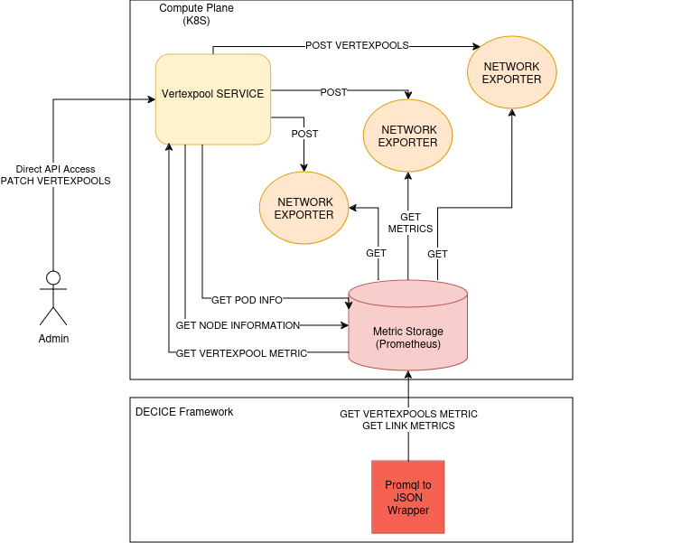
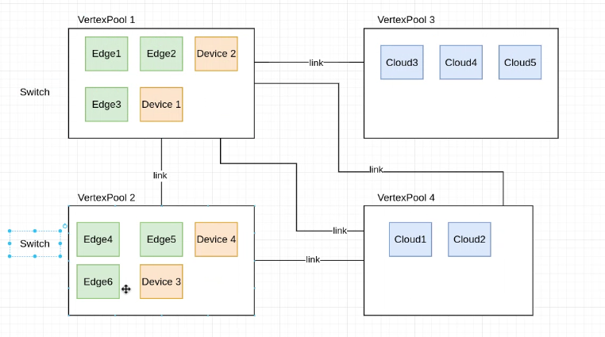
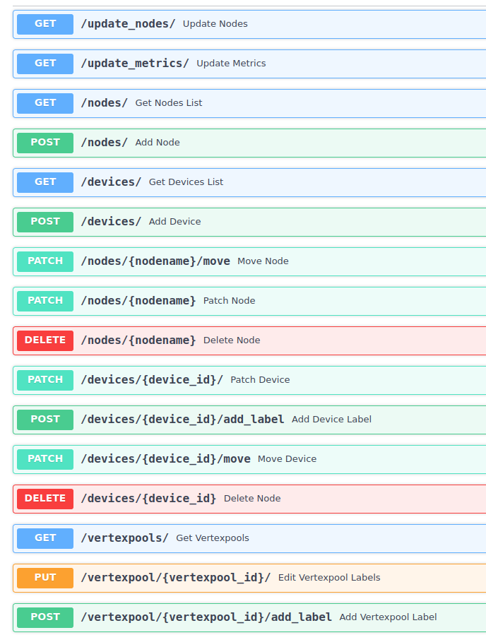
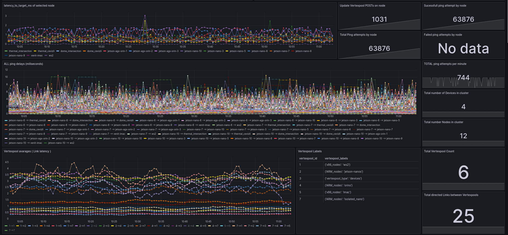

## WATMON-DECICE 
WATMON-DECICE aims to measure additonal network metrics that are not found in Prometheus node expoter . Network exporters collect node-to-node and node-to-device network metrics. They are controlled by a central component called Vertexpool Service.   

## Requirements:
Kube-prometheus-stack helm chart needs to be installed. Kube-state-metrics needs to be enabled for pods and nodes.  [A documentation on how-to exists here.](https://decice.pages-ce.gwdg.de/documentation/how-tos/prometheus/index.html#kubernetes-labels)   
Tested with:
- kube-prometheus-stack helm chart version 59.1.0
- Kubernetes version v1.28.6 with flannel CNI
- Kubeedge version v1.17.0 with flannel CNI
## Build
Requires docker and make. Build the images and push them to your registery   
```sh
cd service
make container_build
docker tag watmon_decice_service:latest <YOUR_REGISTERY>/watmon_decice_service:latest
docker push <YOUR_REGISTERY>/watmon_decice_service
cd .. && cd exporter
#build the regular exporter image for x86
make container_build
docker tag watmon_decice_network_exporter:latest <YOUR_REGISTERY>/watmon_decice_network_exporter_cloud:latest

#(optional) build the exporter for ARM (for kubeedge nodes)
make container_build #(optional) inside an ARM device or emulator
docker tag watmon_decice_network_exporter:latest <YOUR_REGISTERY>/watmon_decice_network_exporter_edge:latest

cd ..
```
## Deploy
Ensure that monitoring namespace exists,kube-prometheus-stack helm chart is installed and kube-state-metrics are enabled for pods and nodes.

### Option 1 - Helm Install
Requires helm
-  Edit the helm chart values. Pay attention to "< EDIT!" comment
    ```sh
    helm show values ./helm-chart > watmon_values.yaml
    nano watmon_values.yaml
    ```

- Install the helm chart
    ```sh
    helm install watmon-decice ./helm-chart/ -f watmon_values.yaml -n monitoring
    helm list
    #check exporters and service pods are running
    kubectl -n monitoring get pods
    #after a while nodes should automatically be assigned to vertexpools
    curl -X 'GET' 'http://<VertexpoolServiceNodeIP>:30098/nodes/' -H 'accept: application/json'

### Option 2 - Edit and kubectl apply 
Edit the manifests, pay attention to "<EDIT" comment. Manifests are :  
- exporter/deployment/watmon_decice_exporter_example.yaml
- service/deployment/pod_example.yaml
- service/deployment/service_monitor_example.yaml


## Vertexpool Service

Vertexpool Service automatically assign each node in cluster to Vertexpools. Vertexpool is an abstraction that groups nodes and devices in the same network together. This is helpfull for two reasons :
- Assuming nodes within the same Vertexpool are connected via a switch for example, and have comparable network metrics beyond the pool, fewer measurements are required between these nodes and nodes in different Vertexpool.
- Network graphs can be depicted with fewer edges. Instead of delineating every node-to-node and node-to-device metric with a distinct edge, metrics associated with each edge can be averaged with respect to Vertexpools. This simplifies the representation, focusing on Vertexpools and the connections between them.  

  
Drawing of the Edge Nodes, Cloud Nodes and Devices grouped under different Vertexpool abstaction. Ideally vertices that are close to each other should be grouped togeter.  
### Vertices 
Inside vertexpools there are vertices. Actual raw network measurements are made between these vertices and laters grouped and abstracted away with Vertexpools. A Vertex can be of a two type:
- **Node**:  These are all the cluster nodes capable of running containers. These will run Network Exporters pods and will make active measurements.For example, a kubeedge node that is part of the cluster.
  
- **Device**: Other nodes that cant run containers on, yet you want to get network measurements to. These can also be external nodes that are not part of a cluster. Examples are a camera that cannot run Kubernetes pods, yet you still want to make network measurements to it. Another example is an external facing server in some data center, which is not part of your cluster.
### Vertexpool Service API
Vertexpool Service holds the Vertexpool, Node and Device state in its database. Network exporter pods and Nodes are automatically discovered and updated from Prometheus thanks to kube-state-metrics. Device and Vertexpool state can be altared via Vertexpool REST API.  
Currently each discovered node is automatically assigned to a new Vertexpool. You can move vertices(nodes and devices) between Vertexpools. You can add any ip as Device and all nodes will make latency measurements to it.   
Measurements between vertices in the same Vertexpool are made less often.   

## Network Exporters 
Network Exporters run on every node in the cluster as a daemonset. Currently each Network Exporter measures latency to every other vertex defined.   
At every measure cycle they select a vertex from each Vertexpool and ping it. Vertex selection is made in a round-robin way for each Vertexpool. They ping a vertex from every "Other" Vertexpools every 5 seconds by default. They ping a vertex from their own Vertexpool every 30 seconds.   
TODO: Add measurement frequency setting to Vertexpool Service API.  
They have an enpoint that listen for POSTs made from Vertexpool Service. With every POST they update:  
- Vertex list : Nodes and Devices and their ip addresses
- Vertexpool State : Which vertex belongs to which Vertexpool
- Settings : Measurement frequency, measurement stratagy (round-robin by default)
## Metrics exposed by Vertexpool Service and Network Exporters.
These metrics can be found in Prometheus.

### Exporter metrics:
- **decice_post_vertexpools_request_count** : Counter on how many times nodes exporter is updated from its vertexpool endpoint.
- **decice_ping_latency_ms** : Gauge on milisecond latency from a node to target node or device.
- **decice_ping_attempts_total** : Counter on how many total ping attempts were made from a node. 
- **decice_ping_success_total** : Counter on total succesfull ping attempts by a node.
- **decice_ping_failed_total** : Counter on total failed ping attempts by a node.

### Vertexpool Service metrics: 
Service exposes state metrics via labels.
- **decice_device_info** : Device information and relationship to vertexpool_id. Labels are: device_id, device_ip, devicename and vertexpool_id
- **decice_node_info** : Node relationship to vertexpool_id. Labels are: nodename, node_ip, vertexpool_id
- **decice_device_labels** : One-to-one relationship between device label JSON string and device_id
- **decice_vertexpool_labels** : One-to-one relationship between vertexpool label JSON string and vertexpool_id

### Usefull Promql queries:

```
#5m avg of ALL node-to-node and node-to-device latencies
(
    (# node to device latency, matched to include self_vertexpool_id and target_vertexpool_id 
    label_replace(avg_over_time(decice_ping_latency_ms{target_type="device"}[5m]), "device_id", "$1", "target_device_id", "(.*)") 
    * on(nodename) group_left(self_vertexpool_id)
    label_replace(decice_node_info,"self_vertexpool_id","$1","vertexpool_id","(.*)")
    * on(device_id) group_left(target_vertexpool_id) 
    label_replace(decice_device_info , "target_vertexpool_id" , "$1", "vertexpool_id", "(.*)")
    )
    OR
    (# node to node latency, matched to include vertexpool_ids
    avg_over_time(decice_ping_latency_ms{target_type="node"}[5m])
    * on(nodename) group_left(self_vertexpool_id)
    label_replace(decice_node_info,"self_vertexpool_id","$1","vertexpool_id","(.*)")
    *on(target_name) group_left(target_vertexpool_id) 
    label_replace(label_replace(decice_node_info,"target_vertexpool_id","$1","vertexpool_id","(.*)"),"target_name","$1","nodename","(.*)")
    )
)
```

```
avg by (target_vertexpool_id,self_vertexpool_id)( # Link latencies between Vertexpools, found by averaging all latencies
    (# node to device latency, matched to include self_vertexpool_id and target_vertexpool_id 
    label_replace(avg_over_time(decice_ping_latency_ms{target_type="device"}[5m]), "device_id", "$1", "target_device_id", "(.*)") 
    * on(nodename) group_left(self_vertexpool_id)
    label_replace(decice_node_info,"self_vertexpool_id","$1","vertexpool_id","(.*)")
    * on(device_id) group_left(target_vertexpool_id) 
    label_replace(decice_device_info , "target_vertexpool_id" , "$1", "vertexpool_id", "(.*)")
    )
    OR
    (# node to node latency, matched to include vertexpool_ids
    avg_over_time(decice_ping_latency_ms{target_type="node"}[5m])
    * on(nodename) group_left(self_vertexpool_id)
    label_replace(decice_node_info,"self_vertexpool_id","$1","vertexpool_id","(.*)")
    *on(target_name) group_left(target_vertexpool_id) 
    label_replace(label_replace(decice_node_info,"target_vertexpool_id","$1","vertexpool_id","(.*)"),"target_name","$1","nodename","(.*)")
    )
)
```
### Metrics Visualized in Grafana

