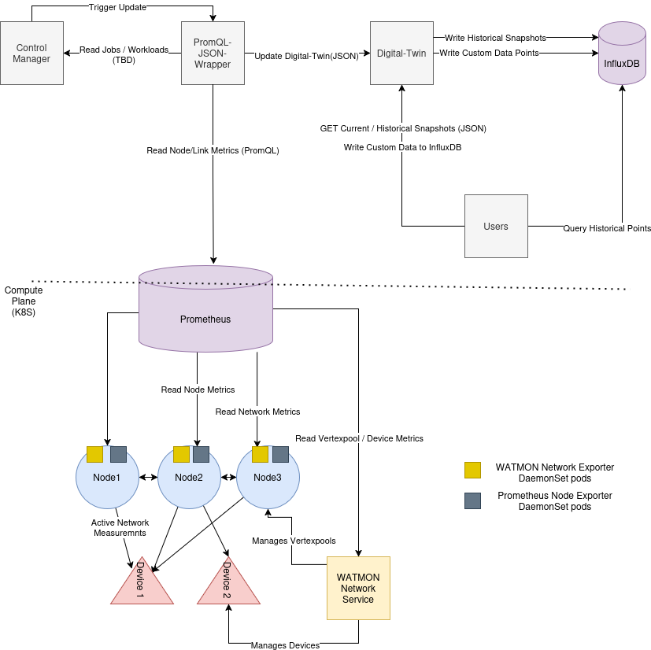

# Prometheus JSON Wrapper

[](<!-- URL to your CI pipeline -->)
[](<!-- URL to your coverage report -->)
[](https://opensource.org/license/apache-1-1)

The Prometheus JSON Wrapper is a specialized data pipeline microservice within the DECICE ecosystem. Its sole responsibility is to act as a bridge between the Prometheus monitoring system and the DECICE Digital Twin.

## Core Responsibility (ETL)

This service performs a classic **Extract, Transform, Load (ETL)** process:

1.  **Extract:** It queries a configured Prometheus instance using a set of pre-defined PromQL queries to gather real-time metrics about nodes, vertex pools, and network links.
2.  **Transform:** It processes and transforms this raw time-series data into a structured, cohesive `DeciceDigitalTwin` Pydantic model.
3.  **Load:** It POSTs the resulting JSON model to the Digital Twin service's `/api/model_core/` endpoint.

This process can be triggered manually via an API call or run automatically on a periodic schedule.

## Overview
The PromQL JSON Wrapper service acts as a bridge between Prometheus metrics and the Digital Twin model. It queries Prometheus with configurable PromQL expressions to retrieve cluster metrics such as node CPU, memory, disk, power consumption metics, network topology metrics and measurements, and device status.

### Architecture



Key Components:
- **Prometheus**: Central metric storage in the Kubernetes compute plane, collecting metrics from:
  - Node exporters (system and hardware metrics)
  - WATMON network exporters and Service (active network measurements and device info)
  - Custom power-related exporters (hardware-specific power usage)
- **PromQL JSON Wrapper**: On trigger (also periodically if configured) queries Prometheus to gather node, network, and device metrics. It aggregates this data and constructs a JSON snapshot representing the current state of the cluster (the Digital Twin).
- **Digital Twin**: Receives the JSON snapshot via HTTP POST from the wrapper service, maintains a real-time model of the cluster, and exposes APIs for querying historical and current snapshots.
- **InfluxDB**: Stores historical snapshots and custom data points written by the Digital Twin and user queries. Allows partial queries on cluster snapshot metrics.
- **Control Manager**: Triggers PromQL-JSON-Wrapper updates and serves workloads/jobs information to it(TBD) to keep the Digital Twin in sync before scheduling.
- **Digital-Twin Users** (e.g. Scheduler Controller and other ...): Access partial metrics by querying InfluxDB, historical and real-time snapshots by querying DigitalTwin.

Data Flow Summary:
  1) Prometheus collects and stores real-time metrics from nodes, devices, and network exporters.
  2) The PromQL JSON Wrapper periodically runs PromQL queries to fetch these metrics.
  3) The PromQL JSON Wrapper constructs a Digital Twin JSON snapshot and POSTs it to the Digital Twin service.
  4) The Digital Twin stores snapshots and writes historical data to InfluxDB.
  5) Users query InfluxDB for partial timeseries metrics or interact with the Digital Twin for real-time and historical snapshot data.


## 🚀 Getting Started

This service is designed to be run as part of the unified, multi-service environment. Please see the main `README.md` in the project root for instructions on how to run the entire system with `docker-compose`.

### Local Development (Standalone)

For focused development on this service, you can run it locally, provided its downstream dependencies (Prometheus, Digital Twin) are accessible over the network.

**1. Install Dependencies**
```bash
poetry install
```

**2. Configure Environment**
Copy the environment template. The default values are configured for the Docker Compose environment, so you may need to edit them if running against services on `localhost`.
```bash
cp .env.example .env
# Edit .env to set PROMETHEUS_HOST, DT_SERVICE_HOST, etc.
```

**3. Run the Service**
```bash
poetry run python src/main.py
```
The API will be available at [http://localhost:8050](http://localhost:8050) (or the configured port).

## 🧪 Running Tests

The service includes a full suite of unit and integration tests to ensure correctness and prevent regressions.

```bash
# Run all tests
poetry run pytest

# Run with a detailed coverage report
poetry run coverage run -m pytest
poetry run coverage report -m
```

## 📄 API Contract

The service provides a minimal API for control and observation. The full OpenAPI specification is available at the `/docs` route when the service is running.

-   **`POST /pool`**: Manually triggers a one-off ETL cycle (Extract from Prometheus, Load to Digital Twin).
-   **`GET /health`**: A simple health check endpoint.
-   **`GET /settings`**: Returns the currently loaded service configuration for debugging purposes.

## ⚙️ Configuration

The service is configured via environment variables, documented in `.env.example`.

| Variable | Description | Example (in `.env.example`) |
| :--- | :--- | :--- |
| **Service** | | |
| `LOG_LEVEL` | The logging level for the application. | `INFO` |
| **Downstream: Prometheus** | | |
| `PROMETHEUS_HOST` | The hostname of the Prometheus service. For Docker, this is the service name. | `prometheus` |
| `PROMETHEUS_PORT` | The port of the Prometheus service. | `9090` |
| **Downstream: Digital Twin** | | |
| `DT_SERVICE_HOST` | The hostname of the Digital Twin service. For Docker, this is the service name. | `digital-twin` |
| `DT_SERVICE_PORT` | The port of the Digital Twin service. | `8010` |
| **Background Task** | | |
| `AUTO_UPDATE_DT_ENABLED`| Set to `true` to enable the periodic background update task. | `false` |
| `AUTO_UPDATE_DT_FREQUENCY_SECONDS` | The interval (in seconds) for the background task. | `30.0` |
| **Custom Queries** | | |
| `POWER_CONSUMPTION_PROMQL_QUERIES` | A JSON-formatted list of strings for custom power metrics. Each query must return values labeled by `nodename` | `'[]'` |

---


### Key Components:
- **Prometheus**: Central metric storage in the Kubernetes compute plane, collecting metrics from:
  - Node exporters (system and hardware metrics)
  - WATMON network exporters and Service (active network measurements and device info)
  - Custom power-related exporters (hardware-specific power usage)
- **PromQL JSON Wrapper**: On trigger (also periodically if configured) queries Prometheus to gather node, network, and device metrics. It aggregates this data and constructs a JSON snapshot representing the current state of the cluster (the Digital Twin).
- **Digital Twin**: Receives the JSON snapshot via HTTP POST from the wrapper service, maintains a real-time model of the cluster, and exposes APIs for querying historical and current snapshots.
- **InfluxDB**: Stores historical snapshots and custom data points written by the Digital Twin and user queries. Allows partial queries on cluster snapshot metrics.
- **Control Manager**: Triggers PromQL-JSON-Wrapper updates and serves workloads/jobs information to it(TBD) to keep the Digital Twin in sync before scheduling.
- **Digital-Twin Users** (e.g. Scheduler Controller and other ...): Access partial metrics by querying InfluxDB, historical and real-time snapshots by querying DigitalTwin.

### Data Flow Summary:
  1) Prometheus collects and stores real-time metrics from nodes, devices, and network exporters.
  2) The PromQL JSON Wrapper periodically runs PromQL queries to fetch these metrics.
  3) The PromQL JSON Wrapper constructs a Digital Twin JSON snapshot and POSTs it to the Digital Twin service.
  4) The Digital Twin stores snapshots and writes historical data to InfluxDB.
  5) Users query InfluxDB for partial timeseries metrics or interact with the Digital Twin for real-time and historical snapshot data.


## Service Dependencies
PromQL queries are made possible by multiple supporting services and exporters. These exporters expose real-time metrics to Prometheus, which the PromQL-JSON-Wrapper queries using PromQL expressions. It aggregates and parses the results into a structured JSON snapshot of the cluster, conforming to the DECICE Digital-Twin schema, and POSTs this snapshot to the Digital-Twin service to update its state.
### Core Monitoring Stack: [kube-prometheus-stack](https://github.com/prometheus-community/helm-charts/tree/main/charts/kube-prometheus-stack)

Monitoring components are deployed via the `kube-prometheus-stack` Helm chart to Kubernetes with custom [values](https://gitlab-ce.gwdg.de/decice/monitoring-stack/-/tree/minio/prometheus-stack). These include:
- **Prometheus** – central metrics storage and query engine
- **[prometheus-operator](https://github.com/prometheus-operator/prometheus-operator)**  manages Prometheus, Alertmanager, and associated configurations via CRDs (e.g. ServiceMonitors)
- **[kube-state-metrics](https://github.com/kubernetes/kube-state-metrics)** – exposes cluster state (e.g., pods, nodes, deployments) as metrics
- **[prometheus-node-exporters](https://github.com/prometheus/node_exporter)** - exposes node-level system and hardware metrics
  - These metrics populate the [Node.metrics](src/models/models.py) field in the Digital-Twin model

### Custom Exporters Compatible with PromQL-JSON-Wrapper
Additional exporters and services provide DECICE-specific metrics such as power consumption, GPU status, and network performance per node.
- **[WATMON-Service and network exporters](https://gitlab-ce.gwdg.de/decice/decice-wp2/-/tree/digital-twin-dev/watmon)** - The central `WATMON-Service` orchestrates network-exporter agents that perform active network measurements on each node.
    - Exported Prometheus metrics include:
      - `decice_vertexpool_labels`
      - `decice_device_info,`
      - `decice_device_labels`
      - `decice_ping_latency_ms`
    - These metrics populate the `Vertexpool`, `Device`, and `Link` models in the [Digital-Twin](src/models/models.py)
- **Custom power-related metric exporters** - Required for exposing instantaneous power usage in Watts per node. They must be deployed based on the hardware platform: Metrics are used to populate `Node.Metrics.power_watts` in the Digital-Twin model
  - [jetson-stats-node-exporter](https://gitlab-ce.gwdg.de/decice/monitoring-stack/-/tree/minio/jetson_stats_node_exporter)
  - [e4-pdu-exporter](https://gitlab-ce.gwdg.de/decice/monitoring-stack/-/tree/minio/e4-pdu-chart)

### Jobs and Workloads (TBD)
TODO:

---
## Usage/Installation

### Run locally

```bash
# given that you have poetry>2.0.0
vim settings.yaml # edit settings for accessiable services
poetry install --no-root # install the dependencies without installing the package
poetry run python src/main.py # run src/main.py script
```

### Install Helm Chart

```bash
helm show values ./deployment/promql-wrapper-chart/ > promql-values.yaml
vim promql-values.yaml # edit helm values
helm install -n decice promql-wrapper ./deployment/promql-wrapper-chart/ -f promql-values.yaml
```
### Hot Reload on ConfigMap Update
Helm Deployment is configured to automatically restart pods only when updated via Helm upgrade.
The pod template includes an annotation with a hash of the ConfigMap contents, which Helm recalculates during helm upgrade. This change triggers Kubernetes to roll out a new set of pods, ensuring the application picks up the updated configuration.

---
## Instantaneous Power Consumption (Watts) per node
Power consumption metrics are hardware-dependent and require custom instrumentation on each node. You must deploy Prometheus exporters that expose power-related metrics per node, such as PDU-based readings or on-chip telemetry.
### Requirements
- Exporters must expose node-level metrics in Prometheus-compatible format.
- Metrics must be labeled with a nodename so that node-specific power usage can be queried and aggregated.
### Customizing Queries
The promql-json-wrapper supports a configurable set of PromQL expressions for fetching instantaneous power usage (in Watts). These queries are defined in the Helm values.yaml under (for local development settings.yaml):
```yaml
settings:
  power_consumption_promql_queries:
    - avg_over_time(pdu_node_power_watts[2m])
    - avg_over_time(integrated_power_mW{statistic="power"}[2m])/1000
```
You can add or modify these PromQL expressions based on your exporters.
Queries must return instantaneous values per node.
#### Applying ConfigMap Changes
If you update the PromQL queries in your ConfigMap using:
```bash
kubectl edit configmap promql-json-wrapper-config -n decice
```
you must restart the Deployment pods to apply the changes. This can be done by running:
```bash
kubectl rollout restart deployment promql-json-wrapper -n decice
```
